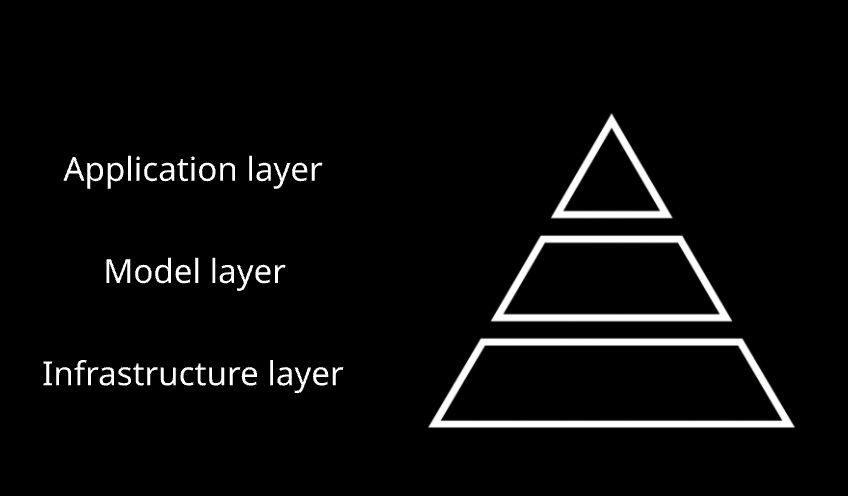

# FM App Toolkit

**Foundation Model Application Toolkit** - Battle-tested patterns and concrete implementations for building production-grade AI applications.

📚 **Read more on [AI Enhanced Engineer](https://aienhancedengineer.substack.com/)** - Deep dives into production AI patterns and practices.

### 📖 Article Series: From Prototype to Production

**Part 1:** [Production AI systems: A reality check - Why production thinking beats prototype culture](https://aienhancedengineer.substack.com/p/a-production-first-approach-to-ai)

**Part 2:** [Production AI Systems: The Data Loading Chaos - Data abstraction for testable AI systems](https://aienhancedengineer.substack.com/p/production-ai-systems-solving-the)

**Part 3.0:** [Production AI Systems: The Unit Testing Paradox](https://aienhancedengineer.substack.com/p/production-ai-systems-the-unit-testing)

**Part 3.1:** Deterministically Testing Agentic Systems - Coming next week

## 🏗️ The Three-Layer AI Stack

In her book [AI Engineering](https://www.oreilly.com/library/view/ai-engineering/9781098166298/), Chip Huyen describes the modern AI stack as a pyramid with **three interconnected layers**. At the foundation lies the **infrastructure layer**—the massive compute resources, GPUs, and cloud platforms that power everything above. In the middle sits the **model layer**, where foundation models like GPT, Claude, and Gemini are trained and fine-tuned. At the top, where most of us work, is the **application layer**—which, as noted in [The AI Engineering Stack](https://newsletter.pragmaticengineer.com/p/the-ai-engineering-stack), has seen **explosive growth** and is where foundation model capabilities meet real-world business needs.


*The AI Stack Pyramid: Each layer depends on the one below, with accessibility increasing as you move up. Source: Adapted from Chip Huyen's AI Engineering framework.*

The pyramid structure reveals an important truth: as you move up the stack, the technology becomes **more accessible** to non-specialists, but paradoxically, building production-grade applications at this layer presents **unique challenges**. You're working with **models you don't control**, **infrastructure you don't manage**, and **outputs that aren't deterministic**<sup>[1](#ref1)</sup>. This is where the FM App Toolkit comes in.

## 💡 The Reality of Building at the Application Layer

Everyone talks about shipping AI apps to production, but **few actually show you how**. We've gathered **nearly a decade of experience** deploying production-grade ML and AI applications, and this repository shares our hard-won insights in a concrete, practical way. Our goal is simple: enable you to rapidly build trustworthy, observable AI applications that can serve real users at scale.

The challenges are real and immediate. Your LLM-powered prototype works perfectly in development, but **production is a different beast entirely**<sup>[2](#ref2)</sup>. **Tests become flaky** with non-deterministic outputs<sup>[3](#ref3)</sup>. **Development costs explode** as every test run consumes API credits. When your agent makes an unexpected decision, **debugging becomes a detective story** without clues. The elegant notebook code needs error handling, monitoring, cost controls, and resilience patterns you hadn't considered<sup>[4](#ref4)</sup>.

**We've been there.** We've built these systems. And we've distilled our experience into this toolkit—**concrete, battle-tested patterns** that bridge the gap between prototype and production<sup>[5](#ref5)</sup>. Using LlamaIndex as our foundation ensures compatibility with the broader ecosystem while our abstractions make testing deterministic and development cost-effective.

## 🔧 Key Components: Bridging the Layers

### Data Loading with Repository Pattern
**Abstracting Infrastructure Concerns**

One of the first challenges in building AI applications is managing multiple data sources that feed into the same pipelines or services. Without proper abstraction, this creates tangled code at the very beginning of your project, directly impacting testability and deployment configurability.

The [Repository pattern](https://www.cosmicpython.com/book/chapter_02_repository.html) solves this elegantly. Whether your data lives in cloud storage, databases, or local file systems, you write your application code once against a clean interface. We provide concrete implementations—`DocumentRepository` as the abstract base, `LocalDocumentRepository` for development and testing, and `GCPDocumentRepository` for production cloud deployments. Switch between them with a single configuration change, maintaining the "build once, deploy anywhere" philosophy that makes rapid iteration possible.

*📚 See Part 2 of our article series above for the full deep dive into this pattern*

### Document Indexing
**Creating Searchable Indexes from Documents**

Once you've loaded your documents, you need to make them searchable. The indexing module provides two fundamental approaches: Vector Store indexes for semantic similarity search and Property Graph indexes for relationship queries.

Our `DocumentIndexer` abstraction allows you to switch between indexing strategies based on your needs. Use `VectorStoreIndexer` when you need to find semantically similar content—perfect for RAG pipelines. Choose `PropertyGraphIndexer` when you need to traverse relationships between entities—ideal for knowledge graphs. Both work seamlessly with our mock framework for deterministic testing.

*See [indexing/README.md](fm_app_toolkit/indexing/README.md) for implementation details*

### Mock LLM Framework
**Simulating the Model Layer for Testing**

We've all heard it: "You can't unit test LLM code." This toolkit proves that wrong. Our mock LLMs provide deterministic responses for unit tests without ever hitting the internet, making your test suite fast, reliable, and free.

The framework extends LlamaIndex's base LLM class for drop-in compatibility. Use `MockLLMWithChain` for sequential multi-step workflows, `MockLLMEchoStream` for testing streaming behavior, or `RuleBasedMockLLM` for dynamic query-based responses. These mocks create a controllable "model layer" for development, enabling you to test edge cases, error conditions, and complex reasoning chains that would be impossible or prohibitively expensive with real models.

*📚 See Part 3.0 of our article series for the complete testing strategy deep dive*

*See [testing/README.md](fm_app_toolkit/testing/README.md) for detailed documentation*

### Agent Implementations
**Application-Layer Orchestration**

What is an agent? At its core, an agent is an orchestration layer that receives requests, reasons about next steps, acts by calling tools, observes results, and iterates until complete. This toolkit provides two complementary approaches:

**LlamaIndex ReAct Agents** - Transparent step-by-step reasoning with full observability of the thought process. Perfect when you need to debug decision-making or handle complex multi-step workflows.

**PydanticAI Agents** - Structured output with built-in validation and observability. Ideal when you need guaranteed data formats and type safety.

Both approaches integrate seamlessly with your business logic through tools, handle errors gracefully, and support deterministic testing with our mock framework.

#### Choosing Your Agent Approach

```python
# LlamaIndex ReAct: Step-by-step reasoning
from fm_app_toolkit.agents.llamaindex import SimpleReActAgent
from fm_app_toolkit.testing import MockLLMWithChain

mock_llm = MockLLMWithChain(chain=[
    "Thought: I need to calculate this.\nAction: multiply\nAction Input: {'a': 15, 'b': 7}",
    "Thought: Now add 23.\nAction: add\nAction Input: {'a': 105, 'b': 23}", 
    "Thought: Done.\nAnswer: 15 × 7 + 23 = 128"
])
agent = SimpleReActAgent(llm=mock_llm, tools=[multiply_tool, add_tool])
result = await agent.run("What is 15 times 7 plus 23?")
# Returns: full reasoning steps + final answer

# PydanticAI: Structured output with validation  
from fm_app_toolkit.agents.pydantic import create_analysis_agent
from pydantic_ai.models.test import TestModel

test_model = TestModel(custom_output_args={
    "sentiment": "positive", 
    "confidence": 0.95,
    "key_insights": ["High satisfaction", "Quality product"]
})
agent = create_analysis_agent(model=test_model)
result = await agent.run("This product is amazing!")  
# Returns: structured AnalysisResult with validated fields
```

*See [agents/llamaindex/README.md](fm_app_toolkit/agents/llamaindex/README.md) for ReAct implementation details and [agents/pydantic/analysis_agent.py](fm_app_toolkit/agents/pydantic/analysis_agent.py) for structured agent examples*

## 🎯 Testing Philosophy

**Deterministic Testing for Non-Deterministic Systems**

Following the principle **"don't mock what you don't own"** from [Architecture Patterns with Python](https://www.cosmicpython.com/book/), we own the abstraction. Our mock LLMs extend framework base classes, creating clean boundaries between business logic and external services.

This approach enables deterministic testing without brittle mocks. Define expected behavior with perfect control, then swap in real LLMs for production—same application code.

*📚 Part 3.0 of our article series explores the theoretical foundations of this approach*

```python
def test_business_workflow():
    mock_llm = MockLLMWithChain(chain=[
        "Thought: Check stock.\nAction: check_stock",
        "Thought: Calculate total.\nAction: calculate_price", 
        "Thought: Done.\nAnswer: Order #123 confirmed"
    ])
    
    agent = SimpleReActAgent(llm=mock_llm, tools=business_tools)
    result = await agent.run("Order 10 widgets")
    
    assert "Order #123" in result["response"]
    assert len(result["sources"]) == 2
```

*See [tests/](tests/) for 149+ test cases demonstrating these patterns.*

## ⚡ Quick Start

### Prerequisites
• Python 3.12+
• Make

### Installation

```bash
# Create environment and install dependencies
make environment-create

# Run tests to verify setup
make unit-test

# See document loading and chunking in action
make process-documents
```

## Basic Usage

### Document Loading

```python
from fm_app_toolkit.data_loading import LocalDocumentRepository

# Load documents from any directory
repo = LocalDocumentRepository(
    input_dir="./docs", 
    required_exts=[".txt", ".md"]
)
documents = repo.load_documents(location="./docs")
```

The key insight: **write your code once, switch data sources with configuration**. The same `load_documents()` call works whether your data is local, in GCS, or anywhere else. See it working: `make process-documents`

### Document Indexing

```python
from fm_app_toolkit.indexing import VectorStoreIndexer, PropertyGraphIndexer
from llama_index.core.embeddings import MockEmbedding

# Vector index for semantic search
vector_indexer = VectorStoreIndexer()
vector_index = vector_indexer.create_index(documents, embed_model=MockEmbedding(embed_dim=256))

# Property graph for relationship queries
graph_indexer = PropertyGraphIndexer()
graph_index = graph_indexer.create_index(documents)
```

### Agents with Deterministic Testing

```python
# LlamaIndex ReAct: Full reasoning visibility
from fm_app_toolkit.agents.llamaindex import SimpleReActAgent
from fm_app_toolkit.testing import MockLLMWithChain

mock_llm = MockLLMWithChain(chain=[
    "Thought: Calculate total.\nAction: calculate_price\nAction Input: {'quantity': 5, 'unit_price': 10}",
    "Thought: Apply discount.\nAnswer: Total is $45 with 10% discount"
])
agent = SimpleReActAgent(llm=mock_llm, tools=[calculate_price_tool])
result = await agent.run("Price for 5 items at $10 each?")

# PydanticAI: Structured output
from fm_app_toolkit.agents.pydantic import create_analysis_agent
from pydantic_ai.models.test import TestModel

test_model = TestModel(custom_output_args={
    "sentiment": "positive", "confidence": 0.9, "word_count": 8
})
agent = create_analysis_agent(model=test_model)
result = await agent.run("Great service and fast delivery!")
# result.output.sentiment == "positive", result.output.confidence == 0.9
```

## 🏭 Production Patterns

### Environment-Based Configuration

Develop with mocks, test with mocks, deploy with real models—same codebase:

```python
def create_agent(environment="development"):
    if environment == "development":
        from fm_app_toolkit.testing import MockLLMWithChain
        llm = MockLLMWithChain(chain=[...])
    else:
        from llama_index.llms.openai import OpenAI
        llm = OpenAI(model="gpt-4")
    return SimpleReActAgent(llm=llm, tools=[...])

# For structured agents  
def create_structured_agent(environment="development"):
    if environment == "development":
        from pydantic_ai.models.test import TestModel
        model = TestModel(custom_output_args={...})
    else:
        model = "openai:gpt-4o"  # Production model string
    return create_analysis_agent(model=model)
```

## Project Structure

```
fm-app-toolkit/
├── fm_app_toolkit/          # Main package
│   ├── agents/              # Agent implementations
│   │   ├── llamaindex/     # ReAct pattern with LlamaIndex
│   │   └── pydantic/       # Structured agents with PydanticAI
│   ├── data_loading/        # Document loading patterns
│   ├── indexing/            # Document indexing strategies
│   ├── testing/             # Mock LLM framework
│   └── tools.py            # Core tool implementations
├── tests/                   # 149+ tests demonstrating patterns
├── Makefile                # Development commands
└── CLAUDE.md              # Development guide
```

Each module has its own README with detailed documentation and examples.

## 🛠️ Development Workflow

### Essential Commands

```bash
# Environment
make environment-create   # First-time setup
make environment-sync     # Update dependencies

# Development
make format              # Auto-format code
make lint               # Fix linting issues
make type-check         # Type checking

# Testing
make unit-test          # Run all tests
make validate-branch    # Pre-commit validation

# Examples
make process-documents  # See document loading and chunking in action
```

## Getting Started with Real Code

The best way to understand these patterns is to see them in action. Explore our [tests/](tests/) directory for 149+ examples of real-world scenarios, or dive into the module-specific documentation:

- [testing/README.md](fm_app_toolkit/testing/README.md) - Mock LLM patterns and deterministic testing
- [agents/llamaindex/README.md](fm_app_toolkit/agents/llamaindex/README.md) - ReAct agents with step-by-step reasoning  
- [agents/pydantic/analysis_agent.py](fm_app_toolkit/agents/pydantic/analysis_agent.py) - Structured agents with validation and Logfire observability
- [data_loading/README.md](fm_app_toolkit/data_loading/README.md) - Repository pattern guide
- [indexing/README.md](fm_app_toolkit/indexing/README.md) - Vector and graph indexing strategies

## 🤝 Contributing

This toolkit grows stronger with community input. We especially welcome:
- Battle-tested patterns from your production deployments
- Novel testing strategies for complex agent behaviors  
- Industry-specific tool implementations
- Real-world case studies and examples

## Related Resources

### Essential Reading
- [AI Engineering Book](https://www.oreilly.com/library/view/ai-engineering/9781098166298/) - Chip Huyen's comprehensive guide to AI engineering
- [The AI Engineering Stack](https://newsletter.pragmaticengineer.com/p/the-ai-engineering-stack) - Gergely Orosz and Chip Huyen on the modern AI stack
- [Building A Generative AI Platform](https://huyenchip.com/2024/07/25/genai-platform.html) - Chip Huyen on platform considerations

### Technical Resources
- [LlamaIndex Documentation](https://docs.llamaindex.ai/) - Official LlamaIndex docs
- [AI Enhanced Engineer](https://aienhancedengineer.substack.com/) - Articles on FM patterns
- [CLAUDE.md](CLAUDE.md) - Development guidelines for this project

## References

### Academic Foundations

<a id="ref1"></a><sup>1</sup> SEI/Carnegie Mellon (2024). ["The Challenges of Testing in a Non-Deterministic World"](https://www.sei.cmu.edu/blog/the-challenges-of-testing-in-a-non-deterministic-world/). Analysis showing why non-deterministic systems make bugs "rare, intermittent, and hard to reproduce."

<a id="ref2"></a><sup>2</sup> Google (2024). ["MLOps: Continuous delivery and automation pipelines in machine learning"](https://cloud.google.com/architecture/mlops-continuous-delivery-and-automation-pipelines-in-machine-learning). Google Cloud Architecture Center. *"The real challenge isn't building an ML model, the challenge is building an integrated ML system and to continuously operate it in production."*

<a id="ref3"></a><sup>3</sup> Faubel, L., Schmid, K. & Eichelberger, H. (2023). ["MLOps Challenges in Industry 4.0"](https://doi.org/10.1007/s42979-023-01934-7). SN Computer Science. Comprehensive analysis of MLOps challenges across different industrial contexts.

<a id="ref4"></a><sup>4</sup> Shankar, S., et al. (2024). ["We Have No Idea How Models will Behave in Production until Production: How Engineers Operationalize Machine Learning"](https://arxiv.org/abs/2403.16795). Study highlighting the experimental nature of ML systems and the challenges of moving from notebooks to production-ready code.

<a id="ref5"></a><sup>5</sup> Sculley, D., et al. (2015). ["Hidden Technical Debt in Machine Learning Systems"](https://papers.nips.cc/paper/2015/hash/86df7dcfd896fcaf2674f757a2463eba-Abstract.html). NeurIPS 2015. The seminal paper that introduced the concept of technical debt in ML systems, highlighting how ML systems can incur massive ongoing maintenance costs through boundary erosion, entanglement, and hidden feedback loops.

### Industry Perspectives

- Huyen, Chip (2023). ["Building LLM applications for production"](https://huyenchip.com/2023/04/11/llm-engineering.html). Practical insights on why "it's easy to make something cool with LLMs, but very hard to make something production-ready with them."
- MLOps Community (2024). [MLOps World Conference Proceedings](https://mlops.community/). Latest practices and challenges in deploying ML systems at scale.

## License

Apache License 2.0 - See [LICENSE](LICENSE) file for details.

---

🚀 **Ready to ship production AI?** Start with `make environment-create` and have your first deterministic agent test running in minutes.

*From nearly a decade of production AI deployments. For developers shipping real systems.*