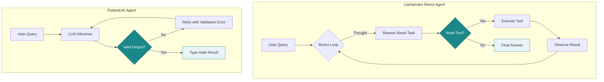

# Agent Implementations

Production-ready agent implementations using LlamaIndex, LangGraph, and PydanticAI. Each implementation demonstrates patterns for building reliable AI agents with deterministic testing support.

## Module Organization

```
agents/
├── llamaindex/              # LlamaIndex ReAct agents
│   ├── minimal_react.py     # Educational: explicit loop (~230 lines)
│   ├── simple_react.py      # Production: BaseWorkflowAgent (~320 lines)
│   ├── simple_react_examples.py  # Usage examples
│   └── sample_tools.py      # Demo tools (weather, calculate, time)
│
├── langgraph/               # LangGraph ReAct agents
│   ├── minimal_react.py     # Educational: explicit graph (~290 lines)
│   └── simple_react.py      # Production: create_react_agent (~170 lines)
│
└── pydantic/                # PydanticAI structured output
    ├── analysis_agent.py    # Text analysis with guaranteed format
    └── extraction_agent.py  # Data extraction with type safety
```

## Architecture

Two architectural approaches for different use cases:



**Figure 1**: Architecture comparison—LlamaIndex ReAct provides transparent multi-step reasoning with observability, while PydanticAI enforces structured output with type safety.

## Six Canonical Harness Components (Article 2.1)

Each component maps to specific code locations:

| Component | LlamaIndex | LangGraph | PydanticAI |
|-----------|------------|-----------|------------|
| **Reasoning Engine** | `llm` parameter | `llm` parameter | `model` parameter |
| **Planning & Orchestration** | `minimal_react.py` loop | `StateGraph` nodes/edges | Agent `run()` |
| **Tool Registry** | `Tool` dataclass | `@tool` decorator | `@agent.tool` |
| **Memory & Context** | `ctx.store` | `AgentState` reducer | `deps` injection |
| **State & Persistence** | `BaseWorkflowAgent` | `CompiledStateGraph` | Result object |
| **Structured I/O** | ReActOutputParser | Message types | Pydantic models |

## Quick Start

```python
from src.agents.llamaindex import MinimalReActAgent, MinimalTool
from src.mocks.llamaindex.mock_trajectory import TrajectoryMockLLMLlamaIndex

# Deterministic responses for learning
mock_llm = TrajectoryMockLLMLlamaIndex(chain=[
    'Thought: I need weather data.\nAction: get_weather\nAction Input: {"location": "Tokyo"}',
    'Thought: Got it.\nAnswer: Tokyo is 22°C and sunny.'
])

# Simple tool
def get_weather(location: str) -> str:
    return f"{location}: 22°C, sunny"

agent = MinimalReActAgent(
    llm=mock_llm,
    tools=[MinimalTool(name="get_weather", description="Get weather", function=get_weather)],
    verbose=True
)

result = await agent.run("What's the weather in Tokyo?")
# result = {"response": "...", "reasoning": [...], "sources": [...]}
```

## Implementation Guide

| Concept | Key Files |
|---------|-----------|
| ReAct Agent Loop | `llamaindex/minimal_react.py` (explicit loop, educational) |
| Six Harness Components | All agent files (see component table above) |
| Testing with Mocks | `src/mocks/llamaindex/`, `src/mocks/langchain/` |
| Framework Comparison | `llamaindex/`, `langgraph/`, `pydantic/` |

## Learning Path

**Understand the loop** → Read `minimal_react.py` (explicit for-loop, regex parsing)

**Use a framework** → Study `simple_react.py` (BaseWorkflowAgent pattern)

**See examples** → Run `simple_react_examples.py`

## Testing

All agents support deterministic testing via mock LLMs:

```python
# LlamaIndex
from src.mocks.llamaindex.mock_trajectory import TrajectoryMockLLMLlamaIndex

# LangGraph
from src.mocks.langchain.mock_trajectory import TrajectoryMockLLMLangChain

# PydanticAI
from pydantic_ai.models.test import TestModel
```

## Further Reading

- [AI Agents in Production](https://aienhancedengineer.substack.com) - Article series covering these patterns in depth
- [LlamaIndex Documentation](https://docs.llamaindex.ai/) - ReAct agent reference
- [PydanticAI Documentation](https://ai.pydantic.dev/) - Structured output agents
