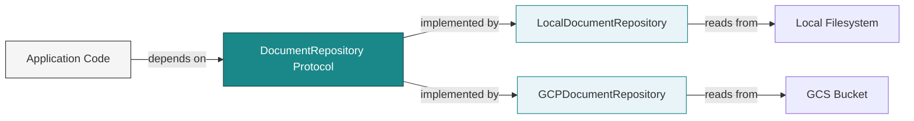

# Data Loading Module

This module implements the Repository Pattern for document and data loading, providing clean abstractions over different data sources while maintaining testability and flexibility.

## Quick Start

```bash
# See the repository pattern in action
just process-documents
```

## File Guide

- **`base.py`** - Abstract interfaces (`BaseRepository`, `DocumentRepository`)
- **`local.py`** - Local filesystem implementations (`LocalRepository`, `LocalDocumentRepository`)  
- **`gcp.py`** - Google Cloud Storage implementation (`GCPDocumentRepository`)
- **`example.py`** - Working demonstration with CLI (`process_documents`)

## Architecture

The Repository Pattern provides a clean abstraction layer between your application and data sources:



**Figure 1**: Repository Pattern architecture showing dependency inversion—application code depends on the protocol, not concrete implementations.

## Key Concepts

**Repository Pattern Benefits:**
- Test without external services (offline development)
- Swap data sources transparently
- Clean separation of business logic from infrastructure
- Dependency injection ready

**Two Repository Types:**
- **BaseRepository**: For structured data (CSV files → pandas DataFrames)
- **DocumentRepository**: For unstructured documents (files → LlamaIndex Documents)

## Usage

### Document Loading
```python
from src.data_loading import LocalDocumentRepository

repo = LocalDocumentRepository(input_dir="./data")
documents = repo.load_documents(location="./data")
```

### CSV Data Loading  
```python
from src.data_loading import LocalRepository

repo = LocalRepository()
df = repo.load_data("./data/customers.csv")
```

### Environment-Based Selection
Your application code stays the same regardless of data source:
```python
def process_documents(repository: DocumentRepository, location: str):
    documents = repository.load_documents(location=location)
    # Business logic here...

# Development: Local files
local_repo = LocalDocumentRepository(input_dir="./test_data")
process_documents(local_repo, "./test_data")

# Production: Cloud storage  
gcp_repo = GCPDocumentRepository()
process_documents(gcp_repo, "gs://prod-docs/knowledge/")
```

## Testing

The pattern enables **offline testing** - see `tests/test_data_loading_integration.py` for comprehensive examples including:
- RAG pipeline construction
- Document chunking workflows
- CSV data quality validation
- Performance testing with realistic datasets

## Architecture Notes

Follows Domain-Driven Design principles:
- Abstractions in `base.py` define contracts
- Concrete implementations handle infrastructure concerns
- Business logic remains pure and testable
- Dependency inversion enables easy mocking

## Further Reading

- [Production AI Systems: Solving the Repository Pattern Challenge](https://aienhancedengineer.substack.com/p/production-ai-systems-solving-the) - Deep dive into design decisions
- [Architecture Patterns with Python](https://www.cosmicpython.com/book/chapter_02_repository.html) - Repository pattern foundations